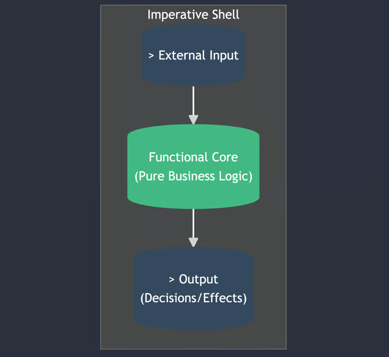
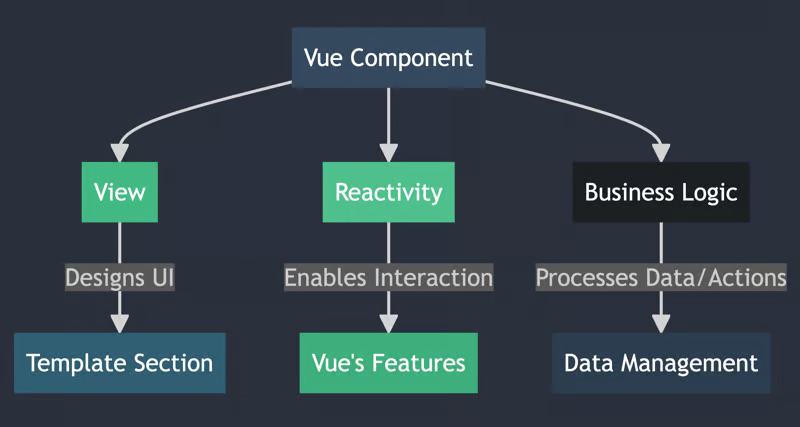

---
layout:
  title:
    visible: true
  description:
    visible: false
  tableOfContents:
    visible: true
  outline:
    visible: true
  pagination:
    visible: false
---

# Clean code với FCIS pattern

> Khi làm việc với Vue3 mình thấy khá thoải mái và flexible với [Composition API](https://vuejs.org/api/composition-api-setup), tuy nhiên khi dự án càng lúc càng phức tạp cả về mặt technical và business dẫn tới việc logic xử lý của component hoặc page trở nên phức tạp.&#x20;
>
> Trong trường hợp này sẽ có nhiều cách để tối ưu code base như: cải thiện file structure, chia các component chi tiết hơn, tách các logic xử lý ra thành từng phần nhỏ...&#x20;
>
> Bài viết này mình sẽ giới thiệu một solution giúp mọi người có thể tách các logic xử lý Side effect, logic xử lý business ra thành từng phần nhỏ.  Giảm tính phức tạp, tăng khả năng maintenace cho dự án.&#x20;

### FCIS pattern là gì?

**FCIS** là viết tắt của Functional Core, Imperative Shell. Sinh ra nhằm mục đích khắc phục các vấn đề của Architecture truyền thống chủ yếu dựa theo mô hình Request-Response (có thể hiểu nôm na là mỗi Software Component đều sẽ có đầu vào là Request và đầu ra là Response)

Mindset chính của FCIS là tách **Business** và **Handle Side Effect** ra làm 2 phần chính:

#### 1. Functional Core (FC)

**FC** là phần core của hệ thống chứa các **Business Logic.** Những function này cần thỏa 2 yếu tố:

* Là một **Pure Function** (là function với một input chỉ trả về duy nhất 1 input)
* Không chứa xử lý **Side Effect**&#x20;

#### 2.  Imperative Shell (IS)

**IS** là nơi xử lý **Side Effec**t của ứng dụng, có thể là: Xử lý DB, API, Side effect component, Third party...

<figure><figcaption><p>FCIS Pattern</p></figcaption></figure>

### Apply FCIS với Vue3

Concept của Vue Component sẽ bao gồm ba thành phần: View, Reactivity và Business Logic. Vì vậy để có thể apply FCIS, mình cần xác định rõ các thành phần trong component.

<figure><figcaption><p>Vue Component Concept</p></figcaption></figure>

Sau khi đã xác định rõ tiến hành tách file theo pattern. Một component cơ bản sẽ có file structure như sau.

```markdown
// File structures
...
│
└───SnakeGame
│   │   index.vue
│   │   ...
│   └───composable
│       │   pureSnake.ts
│       │   useSnake.ts
│       │   ...
```

View template sẽ để tập trung ở file `index.vue`

Xử lý Logic (tính toán, business) để ở file `pure...`

Xử lý Side Effect để ở file `use...`

### Code Sample: Snake Game

<details>

<summary>Trước khi apply </summary>

```javascript
<template>
  <div class="game-container">
    <canvas ref="canvas" width="400" height="400"></canvas>
  </div>
</template>

<script setup lang="ts">
import { onMounted, onUnmounted, ref } from 'vue';

const canvas = ref<HTMLCanvasElement | null>(null);
const ctx = ref<CanvasRenderingContext2D | null>(null);
let snake = [{ x: 200, y: 200 }];
let direction = { x: 0, y: 0 };
let lastDirection = { x: 0, y: 0 };
let food = { x: 0, y: 0 };
const gridSize = 20;
let gameInterval: number | null = null;

onMounted(() => {
  if (canvas.value) {
    ctx.value = canvas.value.getContext('2d');
    resetFoodPosition();
    gameInterval = setInterval(gameLoop, 100);
  }
  window.addEventListener('keydown', handleKeydown);
});

onUnmounted(() => {
  window.removeEventListener('keydown', handleKeydown);
});

function handleKeydown(e: KeyboardEvent) {
  e.preventDefault();
  switch (e.key) {
    case 'ArrowUp': if (lastDirection.y !== 0) break; direction = { x: 0, y: -gridSize }; break;
    case 'ArrowDown': if (lastDirection.y !== 0) break; direction = { x: 0, y: gridSize }; break;
    case 'ArrowLeft': if (lastDirection.x !== 0) break; direction = { x: -gridSize, y: 0 }; break;
    case 'ArrowRight': if (lastDirection.x !== 0) break; direction = { x: gridSize, y: 0 }; break;
  }
}

function gameLoop() {
  updateSnakePosition();
  if (checkCollision()) {
    endGame();
    return;
  }
  checkFoodCollision();
  draw();
  lastDirection = { ...direction };
}

function updateSnakePosition() {
  for (let i = snake.length - 2; i >= 0; i--) {
    snake[i + 1] = { ...snake[i] };
  }
  snake[0].x += direction.x;
  snake[0].y += direction.y;
}

function checkCollision() {
  return snake[0].x < 0 || snake[0].x >= 400 || snake[0].y < 0 || snake[0].y >= 400 ||
         snake.slice(1).some(segment => segment.x === snake[0].x && segment.y === snake[0].y);
}

function checkFoodCollision() {
  if (snake[0].x === food.x && snake[0].y === food.y) {
    snake.push({ ...snake[snake.length - 1] });
    resetFoodPosition();
  }
}

function resetFoodPosition() {
  food = {
    x: Math.floor(Math.random() * 20) * gridSize,
    y: Math.floor(Math.random() * 20) * gridSize,
  };
}

function draw() {
  if (!ctx.value) return;
  ctx.value.clearRect(0, 0, 400, 400);
  drawGrid();
  drawSnake();
  drawFood();
}

function drawGrid() {
  if (!ctx.value) return;
  ctx.value.strokeStyle = '#ddd';
  for (let i = 0; i <= 400; i += gridSize) {
    ctx.value.beginPath();
    ctx.value.moveTo(i, 0);
    ctx.value.lineTo(i, 400);
    ctx.value.stroke();
    ctx.value.moveTo(0, i);
    ctx.value.lineTo(400, i);
    ctx.value.stroke();
  }
}

function drawSnake() {
  ctx.value.fillStyle = 'green';
  snake.forEach(segment => {
    ctx.value.fillRect(segment.x, segment.y, gridSize, gridSize);
  });
}

function drawFood() {
  ctx.value.fillStyle = 'red';
  ctx.value.fillRect(food.x, food.y, gridSize, gridSize);
}

function endGame() {
  clearInterval(gameInterval as number);
  alert('Game Over');
}

</script>

<style>
.game-container {
  display: flex;
  justify-content: center;
  align-items: center;
  height: 100vh;
}
</style>
```


</details>

<details>

<summary>Sau khi apply pattern</summary>

<pre class="language-javascript"><code class="lang-javascript"><strong>// index.vue
</strong>&#x3C;template>
  &#x3C;div class="game-container">
    &#x3C;canvas ref="canvas" width="400" height="400">&#x3C;/canvas>
  &#x3C;/div>
&#x3C;/template>

&#x3C;script setup lang="ts">
import { ref, onMounted, watch, onUnmounted } from 'vue';
import { useGameSnake } from './useGameSnake.ts';
import { gridSize } from './pureGameSnake';

const { snake, direction, food, gameState } = useGameSnake();
const canvas = ref&#x3C;HTMLCanvasElement | null>(null);
const ctx = ref&#x3C;CanvasRenderingContext2D | null>(null);
let lastDirection = { x: 0, y: 0 };

onMounted(() => {
  if (canvas.value) {
    ctx.value = canvas.value.getContext('2d');
    draw();
  }
  window.addEventListener('keydown', handleKeydown);
});

onUnmounted(() => {
  window.removeEventListener('keydown', handleKeydown);
});

watch(gameState, (state) => {
  if (state === 'over') {
    alert('Game Over');
  }
});

function handleKeydown(e: KeyboardEvent) {
  e.preventDefault();
  switch (e.key) {
    case 'ArrowUp': if (lastDirection.y !== 0) break; direction.value = { x: 0, y: -gridSize }; break;
    case 'ArrowDown': if (lastDirection.y !== 0) break; direction.value = { x: 0, y: gridSize }; break;
    case 'ArrowLeft': if (lastDirection.x !== 0) break; direction.value = { x: -gridSize, y: 0 }; break;
    case 'ArrowRight': if (lastDirection.x !== 0) break; direction.value = { x: gridSize, y: 0 }; break;
  }
  lastDirection = { ...direction.value };
}

watch([snake, food], () => {
  draw();
}, { deep: true });

function draw() {
  if (!ctx.value) return;
  ctx.value.clearRect(0, 0, 400, 400);
  drawGrid();
  drawSnake();
  drawFood();
}

function drawGrid() {
  if (!ctx.value) return;
  ctx.value.strokeStyle = '#ddd';
  for (let i = 0; i &#x3C;= 400; i += gridSize) {
    ctx.value.beginPath();
    ctx.value.moveTo(i, 0);
    ctx.value.lineTo(i, 400);
    ctx.value.stroke();
    ctx.value.moveTo(0, i);
    ctx.value.lineTo(400, i);
    ctx.value.stroke();
  }
}

function drawSnake() {
  ctx.value.fillStyle = 'green';
  snake.value.forEach(segment => {
    ctx.value.fillRect(segment.x, segment.y, gridSize, gridSize);
  });
}

function drawFood() {
  ctx.value.fillStyle = 'red';
  ctx.value.fillRect(food.value.x, food.value.y, gridSize, gridSize);
}
&#x3C;/script>

&#x3C;style>
.game-container {
  display: flex;
  justify-content: center;
  align-items: center;
  height: 100vh;
}
&#x3C;/style>

// pureSnake.ts
export const gridSize = 20;

export function initializeSnake() {
  return [{ x: 200, y: 200 }];
}

export function moveSnake(snake, direction) {
  let newSnake = snake.map((segment, index) => {
    if (index === 0) {
      return { x: segment.x + direction.x, y: segment.y + direction.y };
    }
    return { ...snake[index - 1] };
  });
  return newSnake;
}

export function isCollision(snake) {
  let head = snake[0];
  let hasCollided = head.x &#x3C; 0 || head.x >= 400 || head.y &#x3C; 0 || head.y >= 400 ||
                    snake.slice(1).some(segment => segment.x === head.x &#x26;&#x26; segment.y === head.y);
  return hasCollided;
}

export function randomFoodPosition() {
  return {
    x: Math.floor(Math.random() * 20) * gridSize,
    y: Math.floor(Math.random() * 20) * gridSize,
  };
}

export function isFoodEaten(snake, food) {
  let head = snake[0];
  return head.x === food.x &#x26;&#x26; head.y === food.y;
}

// useGameSnake.ts
import { onMounted, onUnmounted, ref } from 'vue';
import * as GameLogic from './pureGameSnake.ts';

export function useGameSnake() {
  const snake = ref(GameLogic.initializeSnake());
  const direction = ref({ x: 0, y: 0 });
  const food = ref(GameLogic.randomFoodPosition());
  const gameState = ref&#x3C;'over' | 'playing'>('playing');
  let gameInterval = null;

  const startGame = () => {
    gameInterval = setInterval(() => {
      snake.value = GameLogic.moveSnake(snake.value, direction.value);

      if (GameLogic.isCollision(snake.value)) {
        gameState.value = 'over';
        clearInterval(gameInterval);
      } else if (GameLogic.isFoodEaten(snake.value, food.value)) {
        snake.value.push({ ...snake.value[snake.value.length - 1] });
        food.value = GameLogic.randomFoodPosition();
      }
    }, 100);
  };

  onMounted(startGame);

  onUnmounted(() => {
    clearInterval(gameInterval);
  });

  return { snake, direction, food, gameState };
}
</code></pre>

</details>

### Lợi điểm&#x20;

* Giảm độ phức tạp của component khi số lượng logic và Side Effect tăng.
* Giúp tách riêng biệt Business Logic, UI Template, Side Effect mang lại các hệ quả như:
  * Dễ dàng viết Testing (Unit Test, UI Test...).
  * Dễ dàng apply các Architecture phức tạp hơn (Clean Code Architect, Micro Service FE,...).
  * Dễ Maintain (vì đã tách nhỏ ra thành các composable nên dễ khoanh vùng issue).&#x20;
